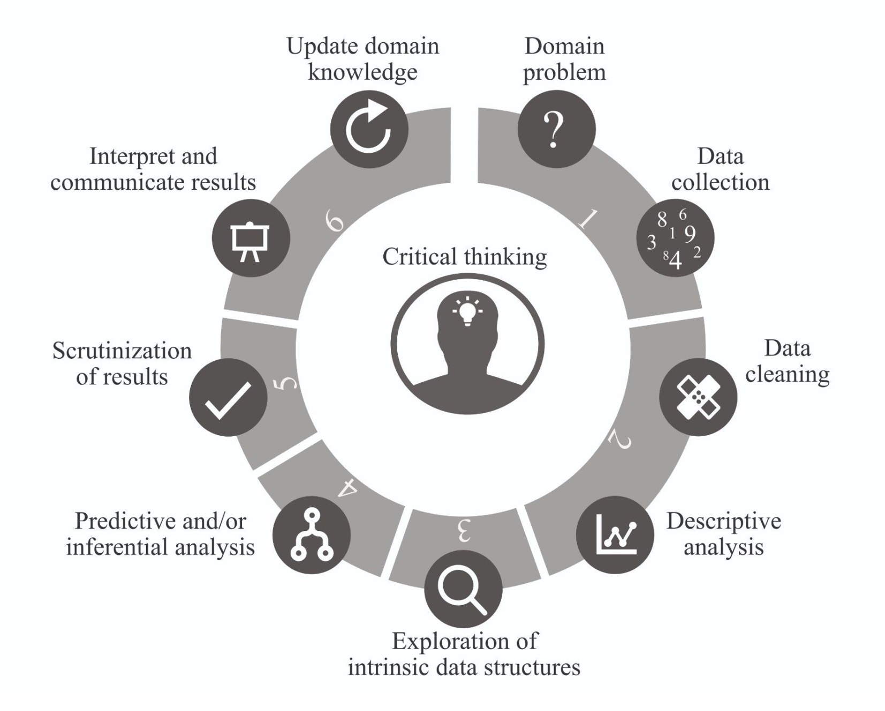

```{r setup, include=FALSE}
knitr::opts_chunk$set(echo = FALSE, message = FALSE, warning = FALSE)
```

# Introduction

## History of Statistics

Etymology:

* 1749: science of dealing with data about the condition of a state or community
    - from German *statistik*

Example:

* 1890 US Census data would take 13 years to be processed by hand
    - new census every 10 years
    - roughly the scale of today's "big data"
* Herman Hollerith (1860-1929) working for the Census Bureau
    - proposed using punch cards to be counted by a machine using the recent discovery of electricity
    - perfect analog to the computer data storage format
    - "Hollerith's Machine" lead to the foundation of IBM
    
## History of Statistics

\begin{center}
\includegraphics[width=0.5\textwidth]{../Plots/hollerith_machine.jpg}
\end{center}

## Today

* applied statistics
* data analytics
* data science
* machine learning
* artificial intelligence

\bigskip
\begin{center}
Inference vs.~prediction?

Boring vs.~cool?

Complicated models vs.~simple solutions?
\end{center}

\bigskip
Quite confusing...

\hfill David Donoho (2015) [50 years of Data Science](https://www.r-statistics.com/2016/01/50-years-of-data-science-by-david-donoho/)

## Why Models?

> We build models in order to
> (1) understand the nature,
> (2) predict the future, and
> (3) control the world. [or was it rule the world?]

\hfill -- Patrick Winston (former director of the AI lab at MIT)

\bigskip
(1) is the main goal of (applied) statistics
    - interpretation
    - parsimony
(2) is the main goal of AI
    - average accuracy
(3) is just to slam the message home

\bigskip\bigskip

> All models are wrong, but some are useful.

\hfill -- George Box

## Job of a Statistician

* think about uncertainty
* estimate variation ($\Rightarrow$ confidence intervals, significance)
* avoid bias (not entirely possible, but anticipate and reduce it)
* build models emulating nature
  - inference about the models leads to conclusions about nature -- but what if the model is a poor emulation of nature?
* provide *interpretable* models allowing for rational conclusions
  - prediction vs. information extraction
  - all models are wrong $\Rightarrow$ critical model validation
* draw conclusions from data
  - this is rather vague since almost everything is data
* traditional role: statisticians invited to analyze existing data
  - problems such as: does the existing data set contain the desired information?
* modern role: collaborative step-by-step
  - from acquisition of data to presentation of results
  - interdisciplinary communication
* exploratory vs. confirmatory analysis

## Cycle of (Data-driven) Science

```{r, out.width='70%', fig.align='center'}

```
\hfill \footnotesize \textcolor{gray}{credit: Bin Yu, Rebecca Barter}

## Domains of Application

- actuarial science
- biostatistics (medicine, pharma, genetics, etc.)
- business
- chemometrics
- econometrics
- epidemiology
- finance
- journalism
- geostatistics
- machine learning and AI
- official statistics (demography, surveys, etc.)
- psychology
- quality control
- reliability
- physics
- signal processing
- ...

# Organization

## Prerequisites

Learning Prerequisites (from the course book):

* REQUIRED COURSES
    - Regression Analysis (a.k.a. regression methods)
    - **Statistical Computation and Visualization** (MATH-517)
* RECOMMENDED COURSES
    - Time Series
    - Statistical Inference

\bigskip    
\pause
Learning Prerequisites (my strong personal recommendation):

* required course:
    - **Statistical Computation and Visualization** (MATH-517)
* somewhat helpful courses:
    - Regression Methods
    - Time Series
    
## Classes

**Lectures**

* Teacher: Tomas Masak
* Time: Monday 13:15-15:00
* Place: MA A1 10

\bigskip

**Exercises**

* Teacher: Charles Dufour
* Time: Wednesday 10:15-12:00
* Place: GC D0 386

\bigskip

Actually, it should be

* 1 h of lecture +
* 3 h of project work

## Content

* **Week 1**: Intro
    - Project 1: Snow Data
* Week 2: Linear Models - Practical Recap
* **Week 3**: Logistic Regression
    - Project 2: Online Shopping Data
* Week 4: Generalized Linear Models
* **Week 5**: Poisson Regression
    - Project 3: Premier League Data
* Week 6: TBD
* **Week 7**: Mixed Models
    - Project 4: U.S. Presidential Elections
* Free Week: Easter Holidays
* **Week 8**: Time Series
    - Project 5: Global Warming
* Week 9: Time Series Regression

## Content (cont.)

The remainder is subject to changes:

* **Week 10**: Extreme Value Theory
    - Project 6: TBD      
* Week 11: more EVT           
* **Week 12**: Functional Data Analysis            
    - Project 7: First Wave of Covid in the US      
* Week 13: Functional PCA
* Week 14: **Oral Exam**
    - discussing your submitted projects
    
**Project deadlines**: Project assigned on (Monday of) Week $X$ has a deadline on Sunday evening of Week $X+1$, i.e. there are always 2 weeks per project.

## Evaluation

* 7 projects in total (for you to choose from)
    - specific data and tasks to perform
    - done individually, but exchange of ideas (but not the code) is encouraged
* 5 projects will form your portfolio
    - Project 1 is mandatory
    - at least one from Projects 2-3
        - you will get a detailed feedback on this
    - at least one from Projects 4-5
    - at least one from Projects 6-7
* Project 1 (linked heavily to MATH-517) gets a grade of its own, the rest will be graded during final examination

\smallskip\smallskip
\begin{exampleblock}{}
$$
\textbf{Final Grade} = ab \vspace*{3mm}
$$
\end{exampleblock}
where $a \in \{0,0.25,0.5,0.75,1\}$ is the grade for Project 1, and $b \in [1,6]$ is the grade for your portfolio to be determined during the oral exam.

## Project Submission

RStudio + R Markdown + Github:

* create **private** `AppStat-SCIPER` folder on Github
    - share the folder with users `TMasak` and `dufourc1`
* one sub-folder `Project-X` for every project, containing
    - the data used
    - `rough_work.Rmd` and the resulting `rough_work.html`
    - `Project-X.Rmd` and the resulting `Project-X.html`, which is the final report to be graded
    - optionally external scripts containing demanding calculations and `.RData` files storing their
    - grading based on `Project-X.html`, other files are for **reproducibility** and cross-checking
* check out an [example project](https://github.com/TMasak/AppStat/tree/main/Project-0)
    - we will go through it on Week 2
    
Moodle: link to the `Project-X` folder will be submitted to the respective Moodle assignment.

## Grading

The grade will reflect on the quality of the final report, which is expected to

* identify questions of interest
    - some will be provided during the lectures together with the data
* choose appropriate models to analyze the data
    - demonstrate understanding of the models used
* implement the models in R
* critically evaluate shortcomings of your models (model diagnostics)
    - a good solutions provides more than one model at first and eventually compares those
* use a final model to answer the questions of interest

## Grading

It is imperative that the final report is

* readable
    - figures need to have self-explanatory captions, appropriate font size, and be generally of a decent quality
    - there should be no code in the report, unless it significantly improves clarity of the report (e.g. R table instead of a Latex table is permitted for simplicity) and even in such a case it has to be verbally explained around any code chunk what it does (the reader is not expected to understand R commands)
* reproducible
    - i.e. the R Markdown file can be run again on a different machine inside your Github repo
    - code contains comments
    
This makes projects iterative work, where most of the work done is underrepresented in the final report

## Report Writing

Some (paraphrased) quotes:

\bigskip
> If a work is not compiled into a report, it does not exist. If the report is not readable and reproducible, the work is useless.

\bigskip
> Think about what you want to write and then write it as clearly and economically as possible. That is all there is to academic writing.


# Project 1

## Data

* data from a PhD student at the Laboratory of Cryospheric Sciences at EPFL, essentially snow-flake diameters
    - shared with the permision of the authors of [this paper](https://www.sciencedirect.com/science/article/pii/S1875963717301246)
* the total number of particles measured (variable `particles.detected`) and the fraction (variable `retained [%]`) of particles belonging to each diameter bin (given by `startpoint` and `endpoint`)
    - only binned data are available (and the grid is not equidistant)

\footnotesize
```{r}
Data <- read.csv("../Data/1_snow_particles.csv")
head(Data)
```

\normalsize

## The Goal

Simulate diameters from a distribution, which is as close as possible to the observed data, in order to study aeolian transport of snow using certain numerical models.

* i.e. the goal is to do Monte Carlo: **how to simulate snow-flake diameters that are compatible with the data?**
* it is assumed that a mixture of two log-normal distributions is a good model.

## Tasks for You

1. Is the assumption viable, i.e. is bi-log-normal distribution a reasonable model for the data?
    - simple exploration of the data
2. Fit the bi-log-normal distribution in order to be able to simulate the data easily.
    - jittering and EM algorithm
    - optimization (e.g. local search starting from the jittered EM result)
    - Bayesian approach
3. Test whether the diameters come from a bi-log-normal distribution.
    - parametric Bootstrap

## StatComp Content

* Week 1: Introduction & Software
* Week 2: Ethics & Reproducibility
* Week 3: Data Exploration & Graphics
* **Week 4: Kernel Density Estimation**
* Week 5: Local Polynomial Regression
* **Week 6: Cross-validation**
* **Week 7: EM Algorithm**
* **Week 8: EM Algorithm**
* **Week 9: Monte Carlo**
* **Week 10: Bootstrap**
* **Week 11: Bootstrap**
* **Week 12: Bayesian Computations**
* **Week 13: Bayesian Computations**
* Week 14: $\emptyset$
    - weeks in bold are pertinent to Project 1
    - Weeks 1-3 established the workflow needed for all the projects


